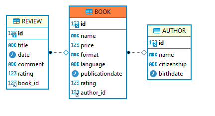
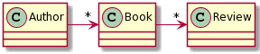

## Escuela Colombiana de Ingeniería

### CVDS – Ciclos de Vida del desarrollo de Software
### Parcial Segundo Tercio


**IMPORTANTE**

* Se puede consultar en la Web: APIs/Documentación de lenguaje y frameworks (Primefaces, Guice, MyBatis, etc), y enunciados de los laboratorios (se pueden revisar los fuentes incluidos con los dichos enunciados).
* No se permite: Usar memorias USB, acceder a redes sociales, clientes de correo, o sistemas de almacenamiento en la nube (Google Drive, DropBox, etc). El uso de éstos implicará anulación.
* El filtrado y ordenamiento de los datos DEBE realizarse en el motor de base de datos, a través del uso de SQL. Consultar todos los datos y filtrarlos en el servidor de aplicaciones -que es supremamente INEFICIENTE- se evaluará como INCORRECTO.


Se le han dado los fuentes de un avance parcial de una plataforma para la administración del contenido de la tienda ECIBook. En esta plataforma los usuarios podrán ver los libros disponibles en la librería de la Escuela Colombiana de ingeniería, adicionalmente se podrán ver las reseñas que han realizado algunos usuarios de los libros y su calificación.

Para el Sprint en curso, se han seleccionado las siguientes historias de usuario del Backlog de producto:

Recuerde que en el formato XML no se puede utilizar '<' y '>', por ejemplo al realizar comparaciones, utilice '&amp;lt;' o '&amp;gt;' respectivamente. 

## Historia de usuario #1

  > **Como** Usuario de la plataforma ECIBook
  >
  > **Quiero** Poder consultar las reseñas de un libro específico.
  >
  > **Para** Conocer la opinión de diferentes usuarios de un libro.
  >
  > **Criterio de aceptación:** Se debe mostrar el id, título, fecha, comentario y calificación. Las reseñas deben estar organizadas por fecha y calificación.


## Historia de usuario #2

  > **Como** Usuario de la plataforma
  >
  > **Quiero** Poder realizar una búsqueda de las reseñas por calificación.
  >
  > **Para** Conocer las reseñas que den una baja calificación.
  >
  > **Criterio de aceptación:** La consulta por calificación debe mostrar todas las reseñas con una calificación menor o igual a un valor ingresado. El reporte debe contener la misma información del reporte anterior donde se muestran las reseñas.

# Modelo 

El modelo de base de datos y de clases asociados a la implementación parcial son los siguientes:





A partir de la aplicación base suministrada, debe realizar lo siguiente:


1.  (50%) Implemente la historia de usuario #1, agregando todo lo que haga falta en la capa de presentación, lógica y de persistencia. La vista debe implementarse en `resena.xhtml`: Dados una author y un libro, mostrar las reseñas disponibles en ECIBook.

2.  (50%) Implemente la historia de usuario #2, agregando todo lo que haga falta en la capa de presentación, lógica y de persistencia. La vista se puede implementar en donde mejor considere que debería quedar: Mostrar el reporte de las reseñas por calificación.


## Entrega

Siga al pie de la letra estas indicaciones para la entrega del examen. EL HACER CASO OMISO DE ESTAS INSTRUCCIONES PENALIZARÁ LA NOTA.

1. Limpie el proyecto

	```bash
	$ mvn clean
	```

2. Configure su usuario de GIT

	```bash
	$ git config --global user.name "Juan Perez"
	$ git config --global user.email juan.perez@mail.escuelaing.edu.co
	```

3. Desde el directorio raíz (donde está este archivo README.md), haga commit de lo realizado.

	```bash
	$ git add .
	$ git commit -m "entrega parcial - Juan Perez"
	```

4. Desde este mismo directorio, comprima todo con: (no olvide el punto al final en la segunda instrucción)

	```bash
	$ zip -r APELLIDO.NOMBRE.zip .
	```

4. Abra el archivo ZIP creado, y rectifique que contenga lo desarrollado.

5. Suba el archivo antes creado (APELLIDO.NOMBRE.zip) en el espacio de moodle correspondiente.

6. ¡IMPORTANTE! Conserve una copia de la carpeta y del archivo .ZIP.